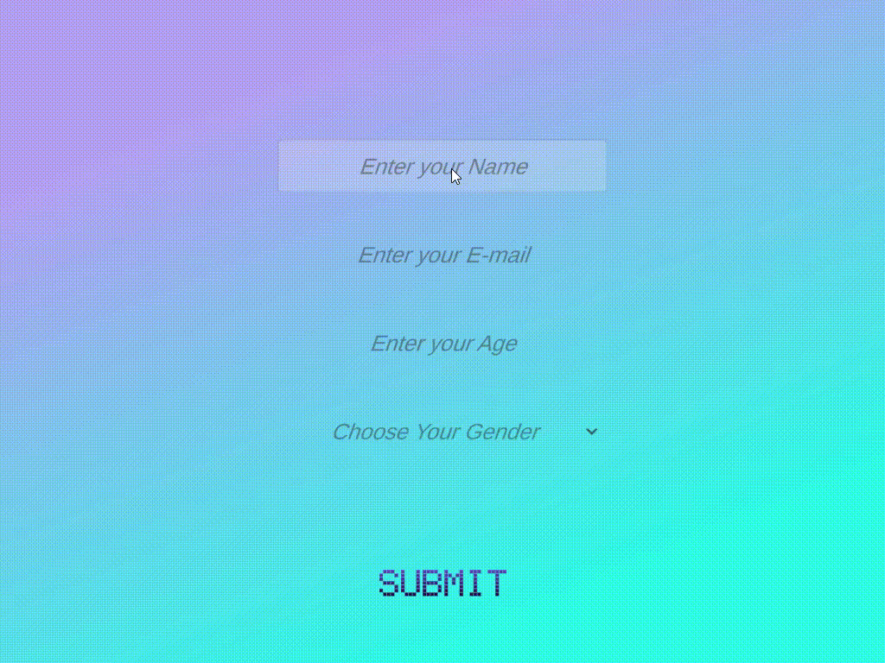

# Stroop-and-Stop

This is a very basic game that I made during my spare time while learning Unity.\
**Note**: There are a lot of things to improve and things that are incomplete; for example, the Stop Signal Test only contains one level, while the Stroop Test contains five levels.

The The game measures User Response Time based on two tests:-
1) [Stroop Test](https://en.wikipedia.org/wiki/Stroop_effect)
2) [Stop Signal Test](https://www.cambridgecognition.com/cantab/cognitive-tests/memory/stop-signal-task-sst/)

The game is almost fully made up of UI Panels.

All the User Details and Response Time for each stage is stored in the path pointed to by [`Application.persistentDataPath`](https://docs.unity3d.com/ScriptReference/Application-persistentDataPath.html).\
For Windows, it is: `%userprofile%\AppData\LocalLow\Company_Name\Product_Name`

The number of Trials in each level is 3. It can be easily be changed by changing the `totalTrials` variable in the Scripts contained inside `Assets/Scripts/StopSignal` and `Assets/Scripts/StroopLevelControllers`.

   
  <b>Intro and Stop Signal</b>

   
  

   
  <b>First two levels of Stroop Test</b>

  

